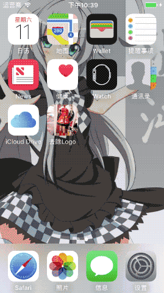

# nikki3rmui

去除奇迹暖暖iOS版截图中的logo等以美观。

注意：如将去掉logo的图片再发布，请自行标注原游戏名。

有一些已知的但是暂不影响正常使用的小问题，将在最近进行修复。

# 操作说明

1. 在游戏中的分享前搭配页面截图，保证只有上边的干扰。
2. 点「分享」，选「拍照」。
3. 在iOS10或更高版本设备上，编译安装并运行此软件。
4. 点「选择截图」，导入第一步中的截图。
5. 点「选择拍照」，导入第二步进行的拍照。
6. 如果此时的预览中上下均有干扰元素，尝试选择「交换位置」。
7. 如果想添加一些额外的效果，可以点「添加效果」。
8. 点「输出图像」，你可以分享和保存到设备相册。

# 许可协议

WTFPL